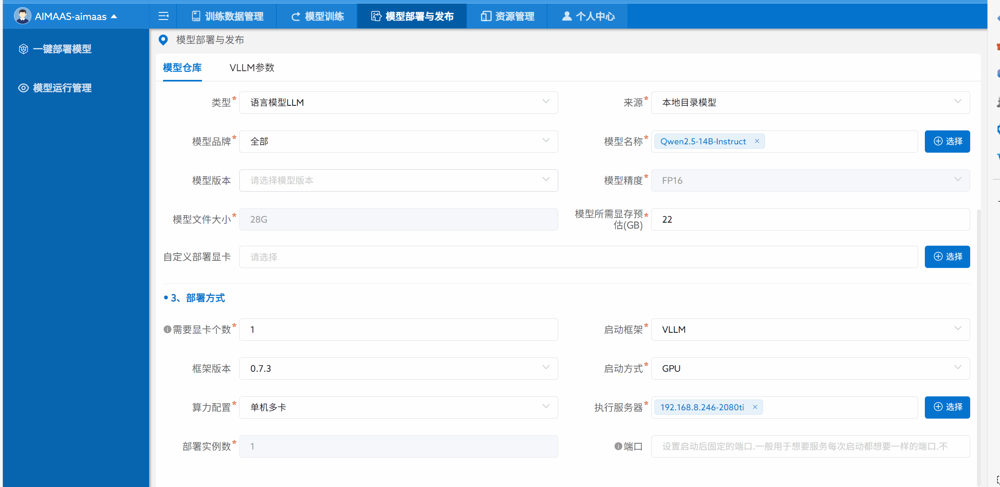

<h3 align="center">
    <p>AIMaaS Platform - Empower you to quickly implement privatized AI capabilities, kick off a new era of intelligence with one click, and fully embrace the future!🤖</p>
</h3>

<h4 align="center">
    <p>
        <b>English</b> |
        <a href="https://github.com/badousoft-com/badou-aimaas/blob/main/i18n/README_zh-hans.md">简体中文</a> |
        <a href="https://github.com/badousoft-com/badou-aimaas/blob/main/i18n/README_zh-hans.md">繁體中文</a> |
    </p>
</h4>

The AIMaaS platform is a "one-stop model service management platform" developed by the Badou AI technical team. It is an integrated model service platform that combines functions such as model deployment and management, model fine-tuning training, and computing resource management. Its goal is to help enterprises quickly realize the privatized deployment and application of large models, support the fine-tuning of professional Q&A knowledge from enterprises or organizations into application models, and accelerate the development of enterprise business intelligence.


**Features include**:

- One-click model deployment: One-click deployment of large language models such as Qwen, Deepseek, GlM, and LLama. You can flexibly set how many graphics cards the model uses to start.
- One-click model start/stop: One-click to start and stop the model.
- Online monitoring of model operation status: View model operation logs online to understand the model's running status.
- One-click model fine-tuning: Quickly perform model fine-tuning training, currently supporting full-parameter fine-tuning, qlora fine-tuning, lora fine-tuning, etc.
- Unified management of multiple computing devices: Supports the management of multiple computing server resources, facilitating the free expansion and management of enterprise computing power.


For any questions or business cooperation, you can directly leave us a message via email: aiservice@badousoft.com

# Case Introduction

Enterprise privatized model deployment application case: A certain enterprise used the AIMaaS platform to deploy on 3 servers with 6 cards each, using entry-level 2080TI graphics cards for deployment.

Server configuration: 2U, 512G memory, 1T disk. Gigabit routers are used to realize server interconnection.

- Server A: Deploy the AIMaaS platform, add the pre-installed k8s to the AIMaaS platform to manage all computing devices.
  - 4 cards: Run DeepSeek-r1-32b to provide language reasoning services. [Note: 4 cards of 2080TI are recommended for no more than 10 users. You can upgrade to 4090 graphics cards to improve concurrency and session response speed]
  - 2 cards: Run Qwen2.5-vl-7b to provide image recognition reasoning services
- Server B: (AIMaaS platform node service, just add the pre-installed k8s to the AIMaaS platform for management)
  - 4 cards: Run Qwen3-32b to provide language interaction services
  - 1 card: Run Bge-large*, a vectorization model
  - 1 card: Run Bge-rerank model
- Server C: (AIMaaS platform node service, just add the pre-installed k8s to the AIMaaS platform for management)
  - 2 cards: Run Qwen2.5-14b to provide language services for question classification, simple problem handling, tool calls, etc.
  - 4 cards: Used for model fine-tuning training, supporting fine-tuning of models below 7b and 14b. [Note: Depending on different training parameters, the time cycle may be relatively long. However, if it is only in lora mode with a small number of rounds, you can perform light fine-tuning on the model to enhance its ability to answer key business questions and self-cognition ability]

The services started through the above configuration can be integrated into Dify, Fastgpt, RagFlow, and n8n for integrated application services.
For example:
You can quickly build applications such as intelligent customer service and intelligent creation through workflow reference.

# Pre-Environment Configuration
To deploy the AIMaaS platform, it is recommended to have a server with independent computing power, and the recommended configurations are as follows:

- 1. Entry-level experience version
     A server with 2 CPUs, 12G memory, 1T disk, and 1-N graphics cards. It is recommended to have 2-4 graphics cards; if not, at least 1 graphics card of 2080TI or higher.
- 1. Professional training version
     More than 2 servers, with each server configured as: 2 CPUs, 512G memory, 2T disk, 4-8 graphics cards. It is recommended to use graphics cards such as 3090, 4090, A100, L40 or higher configurations.

Recommended operating systems: centos7.9+, Ubuntu20+ or higher.


# Quick Start

- ## Image one-click deployment and service startup method

  Note:

  - 1. Need to install docker and k8s-1.22.17 first.
  - 1. You can start downloading the image and starting the service through the following commands.
  - 1. The 8080 port can be modified. Note: Optional, you can directly modify -p 8080:8080 -e BASE_URL=127.0.0.1:8080.
  - 1. The default access path is [127.0.0.1:8080/badouai-maas/](http://127.0.0.1:8080/badouai-maas/)
  - 1. Initial account and password: aimaas/aimaas2025
```bash
docker run -d -p 8080:8080 -e BASE_URL=127.0.0.1:8080 crpi-wfhl7cyuhi65rl7p.cn-guangzhou.personal.cr.aliyuncs.com/fadsii/badou-aimaas:1.0
```

- ## Source code startup method


```python
git clone 
# Initialize and run the frontend
cd web
npm install --registry=https://registry.npm.taobao.org
# Start the service
npm run dev
 
# Initialize and run the backend (return to the project root directory)
cd aimaas-server
mvn package 
# Place the project in the webapps directory of Tomcat running on port 8080
# After successful operation, visit http://127.0.0.1:8000/badouai-maas/#/
```

------

# Demonstration

## Demonstration: One-click model deployment process

Shows the entire process from "selecting a model" to "starting the service", including version selection, resource configuration (CPU/GPU), deployment confirmation, and a prompt for successful startup.



## Demonstration: Online model fine-tuning operation and effect comparison of fine-tuned models

Shows how to upload fine-tuning datasets, configure fine-tuning parameters (learning rate, number of iterations, etc.), start fine-tuning tasks, and check real-time training progress.

# Available commercial cooperation services
- 1. Assist in privately building computing power servers, such as: a computing power cluster of 2 servers with 6 cards each. Enabling enterprises to quickly implement privatized AI capabilities at low cost.
- 1. Customizable AIMaaS platform to be integrated into enterprise services.
- 1. Assist in model fine-tuning and provide solution suggestions.
       (For any questions or business cooperation, you can directly leave us a message via email: aiservice@badousoft.com)


# Supported Training Models

|                            Model                             |            Model Size            |
| :----------------------------------------------------------: | :------------------------------: |
|      [Baichuan 2](https://huggingface.co/baichuan-inc)       |              7B/13B              |
|           [ChatGLM3](https://huggingface.co/THUDM)           |                6B                |
|       [Command R](https://huggingface.co/CohereForAI)        |             35B/104B             |
|      [BLOOM/BLOOMZ](https://huggingface.co/bigscience)       |   560M/1.1B/1.7B/3B/7.1B/176B    |
|  [DeepSeek (Code/MoE)](https://huggingface.co/deepseek-ai)   |         7B/16B/67B/236B          |
|     [DeepSeek 2.5/3](https://huggingface.co/deepseek-ai)     |            236B/671B             |
| [DeepSeek R1 (Distill)](https://huggingface.co/deepseek-ai)  |   1.5B/7B/8B/14B/32B/70B/671B    |
|           [Falcon](https://huggingface.co/tiiuae)            |         7B/11B/40B/180B          |
|          [Falcon-H1](https://huggingface.co/tiiuae)          |       0.5B/1.5B/3B/7B/34B        |
|   [Gemma/Gemma 2/CodeGemma](https://huggingface.co/google)   |           2B/7B/9B/27B           |
|      [Gemma 3/Gemma 3n](https://huggingface.co/google)       |       1B/4B/6B/8B/12B/27B        |
|   [GLM-4/GLM-4-0414/GLM-Z1](https://huggingface.co/THUDM)    |              9B/32B              |
|          [GLM-4.1V](https://huggingface.co/THUDM)*           |                9B                |
|       [GPT-2](https://huggingface.co/openai-community)       |       0.1B/0.4B/0.8B/1.5B        |
|    [Granite 3.0-3.3](https://huggingface.co/ibm-granite)     |           1B/2B/3B/8B            |
|          [Hunyuan](https://huggingface.co/tencent/)          |                7B                |
|          [Index](https://huggingface.co/IndexTeam)           |               1.9B               |
|       [InternLM 2-3](https://huggingface.co/internlm)        |            7B/8B/20B             |
|      [InternVL 2.5-3](https://huggingface.co/OpenGVLab)      |       1B/2B/8B/14B/38B/78B       |
|         [Kimi-VL](https://huggingface.co/moonshotai)         |               16B                |
|      [Llama](https://github.com/facebookresearch/llama)      |          7B/13B/33B/65B          |
|         [Llama 2](https://huggingface.co/meta-llama)         |            7B/13B/70B            |
|       [Llama 3-3.3](https://huggingface.co/meta-llama)       |           1B/3B/8B/70B           |
|         [Llama 4](https://huggingface.co/meta-llama)         |            109B/402B             |
|    [Llama 3.2 Vision](https://huggingface.co/meta-llama)     |             11B/90B              |
|         [LLaVA-1.5](https://huggingface.co/llava-hf)         |              7B/13B              |
|        [LLaVA-NeXT](https://huggingface.co/llava-hf)         |      7B/8B/13B/34B/72B/110B      |
|     [LLaVA-NeXT-Video](https://huggingface.co/llava-hf)      |              7B/34B              |
|          [MiMo](https://huggingface.co/XiaomiMiMo)           |                7B                |
|          [MiniCPM](https://huggingface.co/openbmb)           |         0.5B/1B/2B/4B/8B         |
| [MiniCPM-o-2.6/MiniCPM-V-2.6](https://huggingface.co/openbmb) |                8B                |
|  [Ministral/Mistral-Nemo](https://huggingface.co/mistralai)  |              8B/12B              |
|     [Mistral/Mixtral](https://huggingface.co/mistralai)      |          7B/8x7B/8x22B           |
|      [Mistral Small](https://huggingface.co/mistralai)       |               24B                |
|            [OLMo](https://huggingface.co/allenai)            |              1B/7B               |
|    [PaliGemma/PaliGemma2](https://huggingface.co/google)     |            3B/10B/28B            |
|      [Phi-1.5/Phi-2](https://huggingface.co/microsoft)       |            1.3B/2.7B             |
|      [Phi-3/Phi-3.5](https://huggingface.co/microsoft)       |              4B/14B              |
|       [Phi-3-small](https://huggingface.co/microsoft)        |                7B                |
|          [Phi-4](https://huggingface.co/microsoft)           |               14B                |
|         [Pixtral](https://huggingface.co/mistralai)          |               12B                |
| [Qwen (1-2.5) (Code/Math/MoE/QwQ)](https://huggingface.co/Qwen) | 0.5B/1.5B/3B/7B/14B/32B/72B/110B |
|          [Qwen3 (MoE)](https://huggingface.co/Qwen)          |   0.6B/1.7B/4B/8B/14B/32B/235B   |
|          [Qwen2-Audio](https://huggingface.co/Qwen)          |                7B                |
|         [Qwen2.5-Omni](https://huggingface.co/Qwen)          |              3B/7B               |
|    [Qwen2-VL/Qwen2.5-VL/QVQ](https://huggingface.co/Qwen)    |         2B/3B/7B/32B/72B         |
|     [Seed Coder](https://huggingface.co/ByteDance-Seed)      |                8B                |
|         [Skywork o1](https://huggingface.co/Skywork)         |                8B                |
|        [StarCoder 2](https://huggingface.co/bigcode)         |            3B/7B/15B             |
|         [TeleChat2](https://huggingface.co/Tele-AI)          |          3B/7B/35B/115B          |
|           [XVERSE](https://huggingface.co/xverse)            |            7B/13B/65B            |
|       [Yi/Yi-1.5 (Code)](https://huggingface.co/01-ai)       |          1.5B/6B/9B/34B          |
|            [Yi-VL](https://huggingface.co/01-ai)             |              6B/34B              |
|          [Yuan 2](https://huggingface.co/IEITYuan)           |           2B/51B/102B            |


# Models supported for deployment

|                         Model                         |          Model Size          |      Core Modalities       |
| :---------------------------------------------------: | :--------------------------: | :------------------------: |
|   [Llama 3-3.3](https://huggingface.co/meta-llama)    |         1B/3B/8B/70B         |       Text Modality        |
|   [Mixtral 8x7B](https://huggingface.co/mistralai)    |             8x7B             |       Text Modality        |
|      [Qwen3 (MoE)](https://huggingface.co/Qwen)       | 0.6B/1.7B/4B/8B/14B/32B/235B |       Text Modality        |
|  [InternVL 2.5-3](https://huggingface.co/OpenGVLab)   |     1B/2B/8B/14B/38B/78B     | Multimodality (Text-Image) |
|     [LLaVA-NeXT](https://huggingface.co/llava-hf)     |    7B/8B/13B/34B/72B/110B    | Multimodality (Text-Image) |
|       [Qwen2.5-VL](https://huggingface.co/Qwen)       |       2B/3B/7B/32B/72B       | Multimodality (Text-Image) |
|         [Yi-VL](https://huggingface.co/01-ai)         |            6B/34B            | Multimodality (Text-Image) |
|     [StarCoder 2](https://huggingface.co/bigcode)     |          3B/7B/15B           |    Text Modality (Code)    |
|      [TeleChat2](https://huggingface.co/Tele-AI)      |        3B/7B/35B/115B        |       Text Modality        |
| [Llama 3.2 Vision](https://huggingface.co/meta-llama) |           11B/90B            | Multimodality (Text-Image) |
|       [Phi-3](https://huggingface.co/microsoft)       |            4B/14B            |       Text Modality        |
|       [ChatGLM3](https://huggingface.co/THUDM)        |              6B              |       Text Modality        |

> Note: The above only shows some of the models that support deployment. The complete list of models can be viewed on the aimaas platform.


# referenced 

```markdown
@inproceedings{zheng2024llamafactory,
  title={LlamaFactory: Unified Efficient Fine-Tuning of 100+ Language Models},
  author={Yaowei Zheng and Richong Zhang and Junhao Zhang and Yanhan Ye and Zheyan Luo and Zhangchi Feng and Yongqiang Ma},
  booktitle={Proceedings of the 62nd Annual Meeting of the Association for Computational Linguistics (Volume 3: System Demonstration88s)},
  address={Bangkok, Thailand},
  publisher={Association for Computational Linguistics},
  year={2024},
  url={http://arxiv.org/abs/2403.13372}
}

@inproceedings{kwon2023efficient,
  title={Efficient Memory Management for Large Language Model Serving with PagedAttention},
  author={Woosuk Kwon and Zhuohan Li and Siyuan Zhuang and Ying Sheng and Lianmin Zheng and Cody Hao Yu and Joseph E. Gonzalez and Hao Zhang and Ion Stoica},
  booktitle={Proceedings of the ACM SIGOPS 29th Symposium on Operating Systems Principles},
  year={2023}
}

@misc{glm2024chatglm,
      title={ChatGLM: A Family of Large Language Models from GLM-130B to GLM-4 All Tools}, 
      author={Team GLM and Aohan Zeng and Bin Xu and Bowen Wang and Chenhui Zhang and Da Yin and Diego Rojas and Guanyu Feng and Hanlin Zhao and Hanyu Lai and Hao Yu and Hongning Wang and Jiadai Sun and Jiajie Zhang and Jiale Cheng and Jiayi Gui and Jie Tang and Jing Zhang and Juanzi Li and Lei Zhao and Lindong Wu and Lucen Zhong and Mingdao Liu and Minlie Huang and Peng Zhang and Qinkai Zheng and Rui Lu and Shuaiqi Duan and Shudan Zhang and Shulin Cao and Shuxun Yang and Weng Lam Tam and Wenyi Zhao and Xiao Liu and Xiao Xia and Xiaohan Zhang and Xiaotao Gu and Xin Lv and Xinghan Liu and Xinyi Liu and Xinyue Yang and Xixuan Song and Xunkai Zhang and Yifan An and Yifan Xu and Yilin Niu and Yuantao Yang and Yueyan Li and Yushi Bai and Yuxiao Dong and Zehan Qi and Zhaoyu Wang and Zhen Yang and Zhengxiao Du and Zhenyu Hou and Zihan Wang},
      year={2024},
      eprint={2406.12793},
      archivePrefix={arXiv},
      primaryClass={id='cs.CL' full_name='Computation and Language' is_active=True alt_name='cmp-lg' in_archive='cs' is_general=False description='Covers natural language processing. Roughly includes material in ACM Subject Class I.2.7. Note that work on artificial languages (programming languages, logics, formal systems) that does not explicitly address natural-language issues broadly construed (natural-language processing, computational linguistics, speech, text retrieval, etc.) is not appropriate for this area.'}
}


@misc{glm2024chatglm,
      title={ChatGLM: A Family of Large Language Models from GLM-130B to GLM-4 All Tools},
      author={Team GLM and Aohan Zeng and Bin Xu and Bowen Wang and Chenhui Zhang and Da Yin and Diego Rojas and Guanyu Feng and Hanlin Zhao and Hanyu Lai and Hao Yu and Hongning Wang and Jiadai Sun and Jiajie Zhang and Jiale Cheng and Jiayi Gui and Jie Tang and Jing Zhang and Juanzi Li and Lei Zhao and Lindong Wu and Lucen Zhong and Mingdao Liu and Minlie Huang and Peng Zhang and Qinkai Zheng and Rui Lu and Shuaiqi Duan and Shudan Zhang and Shulin Cao and Shuxun Yang and Weng Lam Tam and Wenyi Zhao and Xiao Liu and Xiao Xia and Xiaohan Zhang and Xiaotao Gu and Xin Lv and Xinghan Liu and Xinyi Liu and Xinyue Yang and Xixuan Song and Xunkai Zhang and Yifan An and Yifan Xu and Yilin Niu and Yuantao Yang and Yueyan Li and Yushi Bai and Yuxiao Dong and Zehan Qi and Zhaoyu Wang and Zhen Yang and Zhengxiao Du and Zhenyu Hou and Zihan Wang},
      year={2024},
      eprint={2406.12793},
      archivePrefix={arXiv},
      primaryClass={id='cs.CL' full_name='Computation and Language' is_active=True alt_name='cmp-lg' in_archive='cs' is_general=False description='Covers natural language processing. Roughly includes material in ACM Subject Class I.2.7. Note that work on artificial languages (programming languages, logics, formal systems) that does not explicitly address natural-language issues broadly construed (natural-language processing, computational linguistics, speech, text retrieval, etc.) is not appropriate for this area.'}
}

@misc{2023xtuner,
    title={XTuner: A Toolkit for Efficiently Fine-tuning LLM},
    author={XTuner Contributors},
    howpublished = {\url{https://github.com/InternLM/xtuner}},
    year={2023}
}
```


# AIMAAS Project License****

This project (including source code, documents, etc.) is subject to the "GNU General Public License Version 3" (GPLv3) and the following supplementary terms:

1. **Scope of License**: Individuals may obtain, use, copy, and modify the project free of charge for non-commercial purposes. Derivative works must be subject to the same license. Commercial use (including integration into commercial products, commercial services, etc.) must obtain written authorization from the project owner and pay the relevant fees.
2. **Distribution and Modification**: When distributing, the original copyright and license information must be retained. Modified works must clearly indicate the modified content and be subject to this license.
3. **Restrictions and Disclaimers**: Use for illegal or infringing activities is prohibited. The project owner does not provide any guarantees, and users shall bear the risks of use on their own.
4. **Governing Law**: This license shall be governed by the laws of the People's Republic of China. Disputes shall first be resolved through negotiation; if negotiation fails, the jurisdiction shall be with the court where the project owner is located.

In case of any conflict between the supplementary terms and GPLv3, the mandatory provisions of GPLv3 shall prevail. The project owner reserves the right to interpret and modify the license, and any modifications will be released through official channels.